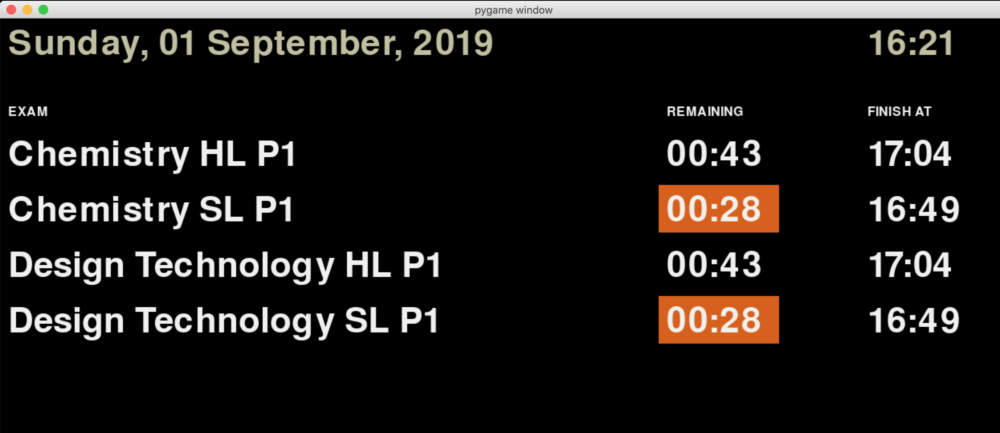

# Examinations Timer (Python version)

A simple Python+Pygame tool that can be used to display exam timing information to invigilators and candidates. I wrote this to replace the "impossible to read whiteboard at the front of a hall" that schools seem to continue to use.



Time remaining will be highlighted in orange at less than 30 minutes, and in red at less than 5 minutes remaining.

## Requirements

Minimum Python 3.6 (uses f-strings). 

The following packages are also required:

```
xlrd
pandas
pygame
```

## Setup

Examination timings are read in from an excel spreadsheet. An example is provided in the project.

## Usage

* Change to the folder containing the `examtimer.py` and `exams.xlsx` files.
* To start on Mac or Linux machines:

```bash
python3 examtimer.py
```

* To start on Windows machines:

```cmd
python examtimer.py
```

* First it will firstly look for the `exams.xlsx` file in the current folder, and will then import the exam sessions and timings.
* A list of exam sessions is displayed. Use your mouse to click on the session you wish to commence.
* The examinations will be displayed and the clock will be paused. Use the following keys to control the examination session:
    * `SPACE` .... Pause / resume the countdown
    * `1` .... add 1 minute to time remaining
    * `2` .... subtract 1 minute from time remaining
    * `L` .... light mode colour scheme
    * `D` .... dark mode colour scheme
    * When paused, `ESC` .... show / hide an these instructions
    * When paused, `X` .... exit the program
